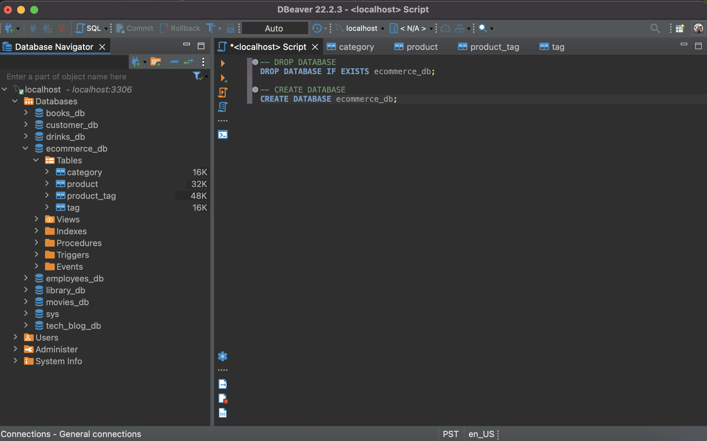
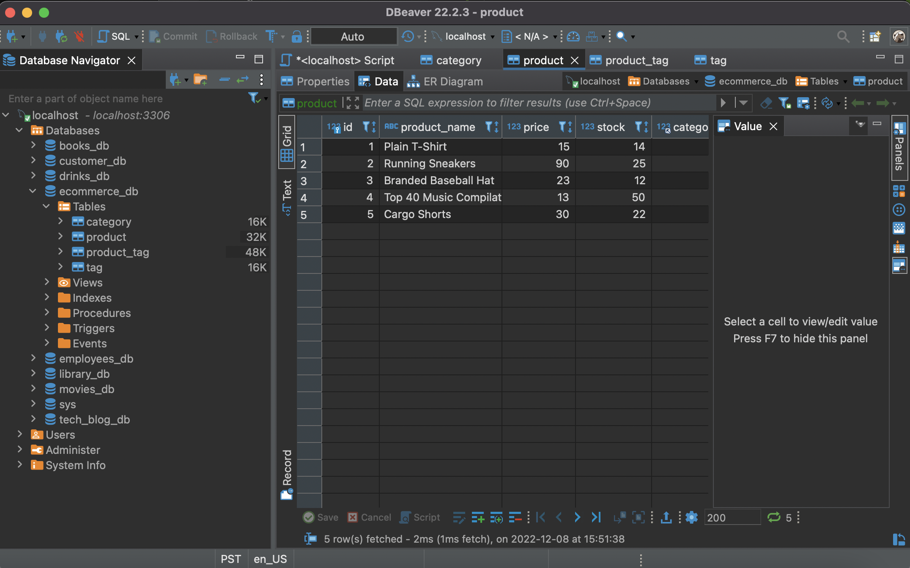
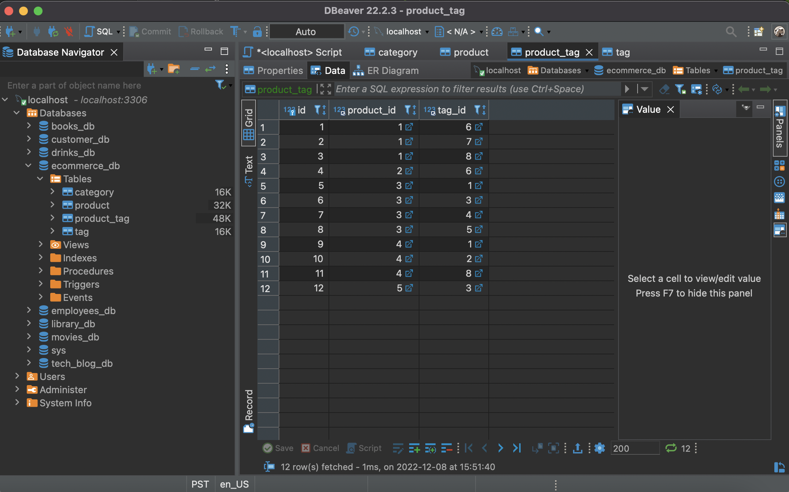
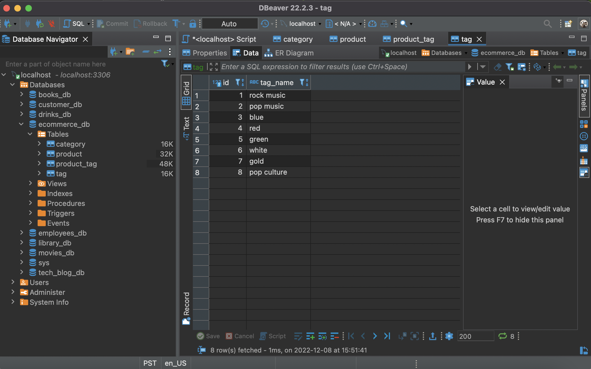

# ORM-E-Commerce-Back-End
A back end for an e-commerce site working with Express.js, Node.js, DBeaver, Insomnia.

## Table of Contents

- [User Story](#user-story)
- [Acceptance Criteria](#acceptance-criteria)
- [Installation and Usage](#installation-and-usage)
- [Contact](#contact)

## User Story

    AS A manager at an internet retail company
    I WANT a back end for my e-commerce website that uses the latest technologies
    SO THAT my company can compete with other e-commerce companies  

[Back to top](#orm-e-commerce-back-end)

## Acceptance Criteria

    GIVEN a functional Express.js API
    WHEN I add my database name, MySQL username, and MySQL password to an environment variable file
    THEN I am able to connect to a database using Sequelize
    WHEN I enter schema and seed commands
    THEN a development database is created and is seeded with test data
    WHEN I enter the command to invoke the application
    THEN my server is started and the Sequelize models are synced to the MySQL database
    WHEN I open API GET routes in Insomnia Core for categories, products, or tags
    THEN the data for each of these routes is displayed in a formatted JSON
    WHEN I test API POST, PUT, and DELETE routes in Insomnia Core
    THEN I am able to successfully create, update, and delete data in my database

[Back to top](#orm-e-commerce-back-end)

## Installation and Usage

1. Clone the repository to your computer locally.
2. In your terminal run `npm i` .
3. Open DBeaver, and copy the schema: 

- DROP DATABASE IF EXISTS ecommerce_db;
- CREATE DATABASE ecommerce_db;

After you execute the script, it will then appear in your databases.

4. In the terminal run: `npm run seed` .

5. In DBeaver, refresh the "ecommerce_db" database. You will then see the tables.

6. In your terminal run: `npm start` .

7. Open Insomnia and enter "http://localhost:3001/api/categories" in Get and click "Send".

8. In Insomnia you can now make Get requests, Put requests, Post requests, and Delete requests.

[Back to top](#orm-e-commerce-back-end)

## Contact

- Feel free to [email](mailto:k.drummond528@gmail.com) me with any questions or comments.

- Connect with me on [LinkedIn](https://www.linkedin.com/in/karinadrummond/).

- Check out my [Portfolio](https://kdrummond528.github.io/React_Portfolio/).

[Back to top](#orm-e-commerce-back-end)

